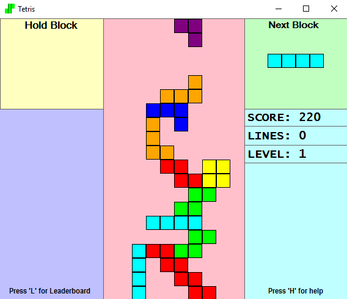

## Tetris for amateurs

Tetris for Amateurs is a variation of the traditional Tetris tile-matching puzzle game written in VB.NET. A matrix rotational algorithm was applied to predefined 2D array structures in order for optimized rotation of Tetriminos on the board. In this Windows Game, the player must rotate, move, and drop the falling Tetriminos inside the Matrix (playing field). Lines are cleared when they are filled with Blocks and have no empty spaces. The goal of this game is to level up as much as possible by clearing the required number of horizontal lines.

## Features
This modification includes many additional features not offered by the classical game, including the ability for the player to hold blocks for future use, display block shadow, and customize block drop speeds. Tetris for Amateurs was designed to allow players to enjoy a less challenging game of Tetris for leisure play while balancing additional strategic elements.

  

### Installation

The exe file can be found at tetris/Tetris/bin/Debug/Tetris.exe. The corresponding source code can be found at tetris/Tetris/Tetris.vb
Note that this game will only run on Windows.
